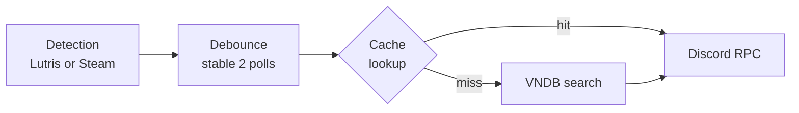
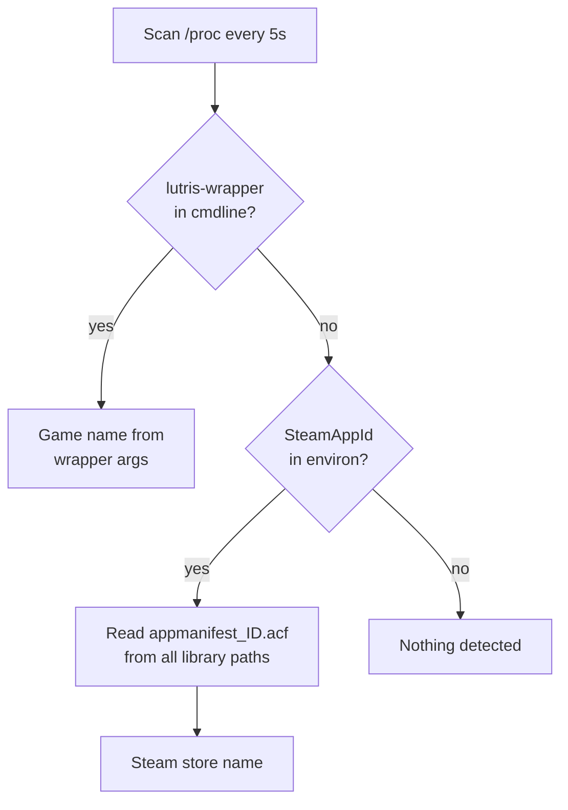
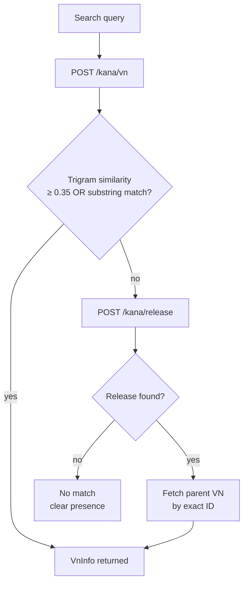
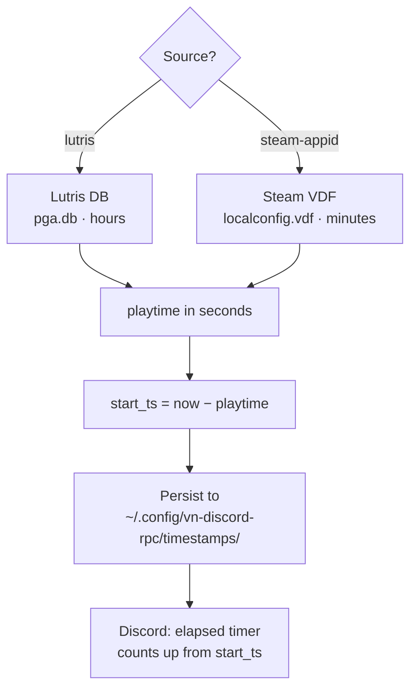

# vn-discord-rpc

Discord Rich Presence daemon for Visual Novels on Linux. Detects games launched via **Lutris** or **Steam**, looks them up on [VNDB](https://vndb.org), and shows the title, cover art, and total playtime in your Discord status.

---

## Features

- Detects games from **Lutris** (exact name from wrapper) and **Steam** (AppID → ACF → store name)
- Fuzzy title matching against VNDB using trigram similarity + full-width character normalisation
- Fallback: searches the **release** endpoint and follows the relation back to the parent VN
- Suppresses explicit cover images (sexual ≥ 2 or violence ≥ 2) — title still shows
- Playtime from **Lutris DB** (`pga.db`) or **Steam VDF** (`localconfig.vdf`) — no API key needed
- Discord elapsed timer reflects **total hours played**, not just this session
- Persistent timestamps survive Discord reconnects
- Editable `cache.csv` for aliases, hard-links, and SKIP entries — reloaded live while running
- `ignore.txt` with exact-match for short entries (< 4 chars) to prevent false positives like `sh`

---

## How it works

### Main loop

Every 5 seconds the daemon runs detection, debounces the result, checks the cache, queries VNDB if needed, and updates Discord.



---

### Detection



Lutris passes the game name explicitly as command-line arguments after `lutris-wrapper`, so the name is always exact. Steam injects `SteamAppId` as an environment variable into every game process — the daemon reads it from `/proc/<pid>/environ`, then finds the matching `.acf` file across all Steam library paths (including custom drives read from `libraryfolders.vdf`).

---

### VNDB resolution



Before the similarity check, full-width ASCII (`！２→!2`, `（→(`) is normalised to half-width so Japanese game names from Lutris match VNDB's stored titles. There is also a substring boost — if the query appears inside the returned title, the score is raised to at least 0.6, handling cases where the detected name is a short prefix of a long VNDB title.

---

### Playtime → Discord elapsed timer



The timestamp is persisted to disk so a Discord reconnect does not reset the timer. On the next startup or reconnect, the file is reloaded and the counter continues from where it was.

---

### Cache file (`cache.csv`)

Located at `~/.config/vn-discord-rpc/cache.csv`. Reloaded automatically whenever the file changes on disk.

| Column | Purpose |
|---|---|
| `key` | Detected Visual Novels name (the search term) |
| `alias` | Redirect this key to a different search term |
| `vndb_id` | `v562`, `v67`, `SKIP`, or empty |
| `title` | Romanised VNDB title (auto-filled) |
| `alt_title` | Original script title, e.g. Japanese (auto-filled) |
| `image_url` | Cover image URL (auto-filled, blank if explicit(sexual or violence)) |
| `image_sexual` | VNDB sexual rating 0–2 (auto-filled) |
| `image_violence` | VNDB violence rating 0–2 (auto-filled) |
| `rating` | VNDB community rating 0–100 (auto-filled) |
| `released` | Release date (auto-filled) |
| `cached_at` | Unix timestamp of last write (auto-filled) |

**Examples:**

```csv
# Alias — fix wrong or garbled detection
Nice boat!,School Days,,,,,,,,

# Skip — suppress presence for this title
妹ぱらだいす！２,,SKIP,,,,,,,

# Hard-link — bypass VNDB query, point directly to an entry
My VN Title,,v67,,,,,,,
```

---

### Ignore list (`ignore.txt`)

Located at `~/.config/vn-discord-rpc/ignore.txt`. One entry per line, `#` for comments. Reloaded automatically while running.

Matching rules:
- Entry **< 4 characters**: exact match (case-insensitive) — (ie. prevents `sh` matching `Higurashi`)
- Entry **≥ 4 characters**: case-insensitive substring match

The default file includes common false-positives: Steam runtimes, Proton, Wine helpers, and launchers.

> [!WARNING]
> If a title has no VNDB match and is not in the ignore list, the daemon will not add it
> to ignore automatically. It will retry the VNDB query on every detection. Add a `SKIP`
> entry in `cache.csv` or an entry in `ignore.txt` to suppress it permanently.

---

## Configuration (`src/config.hpp`)

> [!CAUTION]
> Do not change the `isImageExplicit()` threshold higher then 2 in `vndb_client.hpp`.
> The values `image_sexual >= 2` and `image_violence >= 2` correspond exactly to VNDB's
> **Explicit** rating level. Lowering the threshold to `>= 1` would suppress **Suggestive**
> covers — artwork that is perfectly appropriate to display publicly. Raising it above `2`
> would cause explicit (pornographic) cover art to appear in your Discord status, visible
> to everyone on your friends list. Displaying explicit content in Discord Rich Presence
> violates [Discord's Terms of Service](https://discord.com/terms) and **may result in a
> permanent account ban**.

| Constant | Default | Description |
|---|---|---|
| `DISCORD_APP_ID` | `1482345564698841189` | Discord application ID |
| `VNDB_MIN_SIMILARITY` | `0.35` | Minimum trigram score to accept a match |
| `POLL_INTERVAL` | `5s` | How often to scan for running processes |
| `VNDB_CACHE_TTL` | `30min` | In-memory VNDB result cache lifetime |
| `STABLE_TITLE_POLLS` | `2` | Polls a title must be stable before acting |

---

## Building

> [!IMPORTANT]
> Initialise submodules before building — the two header-only dependencies are not
> downloaded automatically.
> ```bash
> git submodule update --init --recursive
> ```

```bash
cmake -B build -DCMAKE_BUILD_TYPE=Release
cmake --build build
```

## Dependencies

| Library | Purpose |
|---|---|
| [discord-presence](https://github.com/EclipseMenu/discord-presence) | Discord Rich Presence (modern C++ rewrite) |
| [nlohmann/json](https://github.com/nlohmann/json) | JSON parsing |
| [libcurl](https://curl.se/libcurl/) | HTTP requests to VNDB API |
| [libsqlite3](https://www.sqlite.org/) | Read Lutris playtime database |

---

## Usage

> [!TIP]
> Run with `--verbose` if a title is not being detected or matched — the debug output shows
> exactly which process was found, what VNDB returned, and the similarity score.

```bash
./vn-discord-rpc            # normal
./vn-discord-rpc --verbose  # debug logging
./vn-discord-rpc --help
```

Launch a game through **Lutris** or **Steam**, and the daemon will detect it automatically. Press `Ctrl+C` to quit cleanly.

---

## File locations

| File | Path |
|---|---|
| Cache | `~/.config/vn-discord-rpc/cache.csv` |
| Ignore list | `~/.config/vn-discord-rpc/ignore.txt` |
| Timestamps | `~/.config/vn-discord-rpc/timestamps/` |
| Lutris DB | `~/.local/share/lutris/pga.db` |
| Steam VDF | `~/.local/share/Steam/userdata/<id>/config/localconfig.vdf` |
